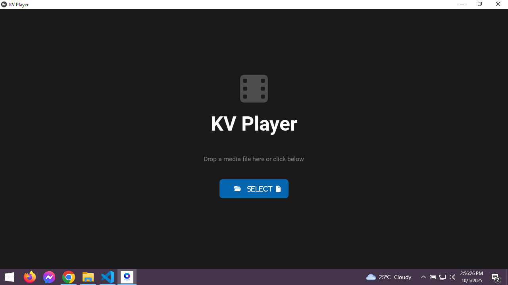

# KV Player
<h1 align="center">🎬 The Professional’s Media Player</h1>

<p align="center">
  <b>A powerful, lightweight, and open-source media player built with Python, Kivy, and FFmpeg — designed for professionals and enthusiasts who demand performance, precision, and a clean interface.</b>
</p>

<p align="center">
  
  
  
  
</p>





---

## 🌟 A Foundation of Excellence

Built from the ground up with **Python**, **Kivy**, and **FFmpeg**, this player redefines performance and simplicity.  
Engineered for **creators, developers, and enthusiasts** who demand **speed, precision, and clarity**.

---

## 📦 Download & Availability

| 🧭 Platform | 💾 Status | 📥 Download |
|:------------|:-----------|:-------------|
| 🪟 **Windows** | ✅ Released | [Download Latest Release](https://github.com/rahulkuzur3/KVPlayer/releases/download/v1.0.0/KVPlayer-v1.0.0-Windows.exe) |
| 🐧 **Linux** | ✅ Released | [ubuntu/debian](#)<br>[Snap](#)<br>[Arch](#)<br>[Fedora/Red Hat](#) |
| 🍎 **macOS** | ⏳ Coming Soon | — |
| 🤖 **Android** | ⏳ Coming Soon | — |
> Cross-platform support is a core goal — seamless playback on every device.
---

### ⚙️ Universal Compatibility
🎥 Plays virtually **any video or audio file**, from ancient codecs to the latest **8K formats**.  
If **FFmpeg** can decode it — this player can play it.

---

### ⚡ Blazing Fast & Lightweight
🚀 Experience **instant startup**, **buttery-smooth playback**, and minimal system usage.  
Efficiency isn’t a feature — it’s the foundation.

---

### 🎨 Pixel-Perfect Playback
🎞️ A custom **rendering engine** ensures **hardware-accelerated decoding** and **accurate color reproduction**.  
Every frame is rendered with **cinematic precision**.

---

### 🔓 Transparent & Open Source
💡 100% **free and open source** — with **no ads, no tracking, and no hidden agendas**.  
The code is open for everyone to learn from, modify, and improve.

---

## 🖤 Sleek. Powerful. Professional.

### 🎛️ Sleek, Minimalist Interface
🖤 A modern **dark-themed UI** that stays out of your way.  
Controls are **auto-hiding**, appearing only when needed — for a distraction-free experience.

---

### ⚡ High-Performance Playback
🔥 Powered by **FFmpeg** through **FFpyplayer**, featuring:  
- **Hardware acceleration (`hw_accel`)**  
- **Fast seeking (`fastseek`)**  
- **Smooth decoding** even for 4K/8K and high-bitrate media

---

### 🧭 Truly Cross-Platform
🖥️ Runs **natively on Windows, macOS, and Linux** — all from a single **Python + Kivy** codebase.  
One build. All platforms.

---

### 🔊 Multi-Audio Track Support
🎧 Automatically detects all available **audio tracks** in your videos.  
Seamlessly switch between **languages**, **commentaries**, or **alternate mixes**.

---

### 🎮 Full Playback Control
🎚️ Designed for precision and comfort:

| 🔘 Control | 💡 Function |
|:-----------|:-------------|
| ▶️ | Play / Pause |
| ⏩ | 10-Second Skip Forward / Backward |
| 📊 | Responsive Seek Bar |
| 🔊 | Volume Slider & Mute |
| 🖥️ | Fullscreen Mode |

---

### 📂 Versatile File Handling
🗂️ Choose how you open your media:
- **Drag & drop** files directly into the player  
- Or use the **“Open File” dialog**, available both on the **welcome screen** and **during playback**

---

## 🧩 Tech Stack

| 🛠️ Component | 🚀 Purpose |
|:-------------|:------------|
| 🐍 **Python** | Core logic and scripting |
| 🎨 **Kivy** | Cross-platform UI framework |
| 🎥 **FFmpeg / FFpyplayer** | Decoding and playback engine |
| 💻 **Platform Support** | Windows, macOS, Linux, Android |

---

## 🚀 Getting Started (Running from Source)

To run the player from the source code, you'll need Python 3.9+ and the required packages.

**1. Clone the repository:**
```bash
git clone https://github.com/rahulkuzur3/KVPlayer.git
cd KVPlayer
```
2. Create a requirements.txt file:
Create a file named requirements.txt in your project folder with the following content:
```
kivy
ffpyplayer
plyer
pyinstaller
```
## 📦 Building an Executable
This project is configured for easy packaging into a single executable file using PyInstaller. The KVPlayer.spec file is universal for Windows, macOS, and Linux.
You must run the build command on the target operating system.
Prerequisites:
 * Make sure you have an icon file in your project directory (icon.ico for Windows, icon.icns for macOS).
 * Ensure all dependencies from requirements.txt are installed.
Build Command:
Open a terminal in the project directory and run:
```
pyinstaller KVPlayer.spec
```
## The final, self-contained application will be located in the dist folder:
 * Windows: dist/KVPlayer.exe
 * macOS: dist/KVPlayer.app
 * Linux: dist/KVPlayer
## 🛠️ Main Dependencies
Kivy: For the cross-platform graphical user interface.
FFpyplayer: A Kivy-compatible video/audio player backend using the powerful FFmpeg library.
Plyer: For accessing native platform features like the file selection dialog.
PyInstaller: For packaging the application into a standalone executable.
Font Awesome: For the modern icons used in the UI.

## 📜 License
This project is licensed under the MIT License - see the LICENSE.md file for details.
